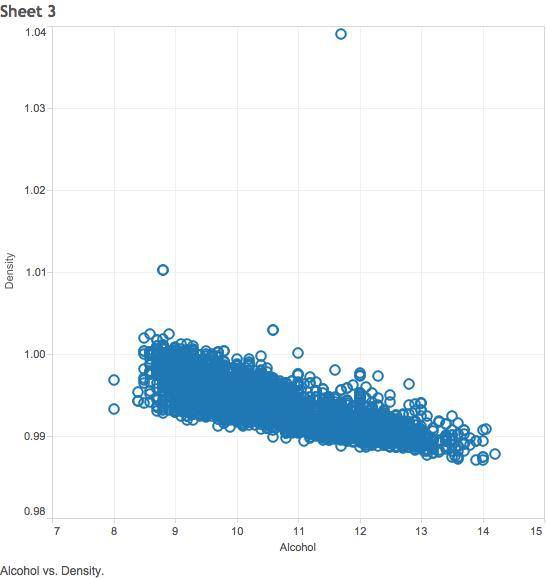

---
output:
  html_document:
    pandoc_args: [
      "+RTS", "-K64m",
      "-RTS"
    ]
---

## Steps

To reproduce Tableau's scatterplot, graph two continuous variables, specifically, the density of the white wine against its alcohol content. This shows an inverse relationship between alcohol content and white wine's density. The less alcohol content a wine had, the more dense it was. This could be due to other substances within the wine that's replacing the density of alcohol with a higher density.

To reproduce the bar graph of Tableau, graph two dimensional variables in rows and the average alcohol content in the column, specifically, the quality of the wine and the respective PH levels of the quality. This graph shows that generally, the better the quality of the wines, the more alcohol content that the wine contains. Also, the highest average alcohol content is concentrated around wine that have PH levels of 3.2 - 3.4. 

  

To reproduce the crosstab table of Tableau, graph one dimensional variable for both the rows and columns of Tableau, specifically quality in rows and pH levels in columns. The key performance indicator (KPI) that we analyzed was Citric Acid / Sugar levels. This can show how sour or sweet a particular white wine tastes. The numbers shown are the citric acid level, residual sugar level, and the KPI of a particular wine with specific PH and quality levels. The colors help show if a partciular wine with those characteristics have a high, low, or medium KPI. A high KPI shows that a wine is more sour, a low kPI shows that a wine is more sweet, and a medium KPI shows a good balance between sweet and sour.

  
